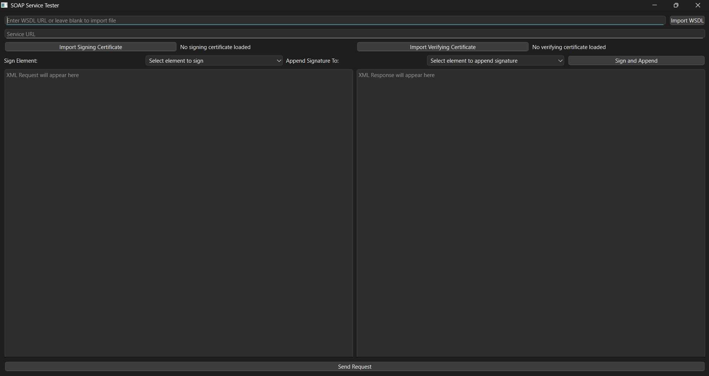

# SoapTester

SoapTester is a Python-based desktop application for testing SOAP web services. Built with PyQt6, it provides a user-friendly GUI to import WSDL files, generate XML requests, sign XML elements with digital certificates, verify response signatures, and send requests to SOAP endpoints. This tool is ideal for developers and testers working with secure SOAP services.

## Features

- **WSDL Import**: Load WSDL files from URLs or local files to initialize the SOAP client.
- **XML Request Generation**: Automatically generate XML request templates based on WSDL schemas.
- **Digital Signatures**: Sign XML elements using PKCS#12 certificates and append signatures to specified elements.
- **Signature Verification**: Verify signatures in SOAP responses using X.509 certificates.
- **Canonicalization**: Canonicalize XML elements (C14N) with UTF-16LE encoding for .NET compatibility.
- **Dual-Pane Editor**: Edit XML requests and view formatted responses side-by-side.
- **Element Selection**: Choose elements for signing and signature appending via dropdown menus.
- **Error Handling**: User-friendly error messages for WSDL parsing, certificate issues, and more.

## Screenshots

*App Screen Ui :*



- Main GUI showing WSDL import and XML editors.
- Certificate import dialog.
- Signed XML request with response.

## Installation

### Prerequisites

- Python 3.8 or higher
- pip (Python package manager)
- Compatible OS: Windows, macOS, or Linux

### Steps

1. Clone the repository:

   ```bash
   git clone https://github.com/<your-username>/SoapTester.git
   cd SoapTester
   ```
2. (Optional) Create a virtual environment:

   ```bash
   python -m venv venv
   source venv/bin/activate  # On Windows: venv\Scripts\activate
   ```
3. Install dependencies:

   ```bash
   pip install PyQt6 zeep cryptography requests lxml
   ```
4. Run the application:

   ```bash
   python SoapTester.py
   ```

## Usage

1. **Launch SoapTester**: Run `python SoapTester.py` to open the GUI.
2. **Import WSDL**:
   - Enter a WSDL URL or click *Import WSDL* to select a local file.
   - The tool populates the service URL and generates an XML request template.
3. **Import Certificates**:
   - Click *Import Signing Certificate* to load a `.p12`/`.pfx` file and enter its password.
   - Click *Import Verifying Certificate* to load a `.pem`/`.crt`/`.cer` file.
4. **Sign XML**:
   - Select an element to sign and an element to append the signature using the dropdowns.
   - Click *Sign and Append* to sign the XML element.
5. **Send Request**:
   - Edit the XML request if needed.
   - Click *Send Request* to send the SOAP request and view the response.
   - If a verifying certificate is loaded, the tool will verify response signatures.

## Example

1. Import a WSDL file (e.g., `http://example.com/service?wsdl`).
2. Load a PKCS#12 certificate for signing and an X.509 certificate for verification.
3. Select an element (e.g., `Body`) to sign and `Header` to append the signature.
4. Edit the generated XML request, then click *Send Request*.
5. View the formatted response and signature verification status.

## Dependencies

- `PyQt6`: GUI framework
- `zeep`: SOAP client and WSDL parsing
- `cryptography`: Certificate handling and signing
- `requests`: HTTP transport
- `lxml`: XML canonicalization
- `xml.etree.ElementTree` and `xml.dom.minidom`: XML processing
- `uuid` and `re`: Utility functions

## Contributing

Contributions are welcome! To contribute:

1. Fork the repository.
2. Create a feature or bug-fix branch.
3. Submit a pull request with a clear description of changes.
4. Follow PEP 8 style guidelines and include tests if possible.

Please open issues for bugs or feature requests.

## License

This project is licensed under the MIT License. See the LICENSE file for details.

## Contact

For questions or support, open an issue on GitHub.